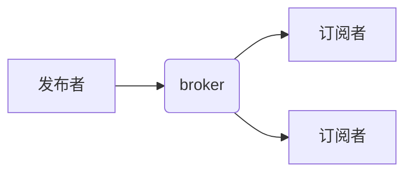

# MQTT 协议v3 VS v5

## MQTT协议是什么？

MQTT全程是**消息队列遥测传输**（英语：Message Queuing Telemetry Transport），它是ISO标准下基于发布（publish）/订阅（subscribe）范式的消息协议，工作于应用层，是为网络状况糟糕而设计的[发布/订阅](https://zh.wikipedia.org/wiki/发布/订阅)型消息协议。

## MQTT组成


协议由两种部分组成：发布者/订阅者，消息代理broker。发布者负责将消息推送至broker，broker将消息推送至匹配的订阅者。其中，消息代理用于接收来自客户端的消息并转发至目标客户端。MQTT 客户端可以是任何运行有 MQTT 库并通过网络连接至消息代理的设备，例如微型控制器或大型服务器。

## 应用场景


APP通过工业协议将数据采集上来，然后发送给固件侧，固件测再上报给云平台。APP至固件与上报云平台都是通过MQTT协议进行发送（若不上报云平台，会将数据存于设备中/var/usr文件夹中）

## 连接过程

发布者：


订阅者：


所有客户端均是向Broker发起操作，发布者和订阅者之间的消息转发也需要经过Broker。消息的转发机制来源于消息的主题，类似于Redis数据库中的标头。订阅者订阅的就是某某主题，broker在收到相关主题消息时，会将消息转发至订阅的客户端。目前有有很多方式启动Broker，例如mosquitto库，emqx消息服务器等。

emqx消息服务器使用方法：

<https://docs.emqx.cn/broker/v4.3/getting-started/install.html#%E5%8C%85%E7%AE%A1%E7%90%86%E5%99%A8%E5%AE%89%E8%A3%85-linux>

网页登录时：localhost:18083，用户名/密码：admin/public

mosquitto库使用方法：

<https://www.jianshu.com/p/7ed37b35f6da>

我们的开发代码也是基于mosquitto库开发的，mosquitto库中支持v3和v5的开发，所有函数名中带有v5字段的均是5.0版本的函数。

## 报文介绍

所有报文均由固定报头，可变报头以及有效负载三部分组成。


**固定报头**


报文类型——bit 4至bit7

|  **Name**   | **Value** |    **流向**    |             **描述**             |
| :---------: | :-------: | :------------: | :------------------------------: |
|  Reserved   |     0     |      禁止      |               保留               |
|   CONNECT   |     1     | 客户端至服务器 |             连接请求             |
|   CONNACK   |     2     | 服务器至客户端 |             连接确认             |
|   PUBLISH   |     3     |      均可      |             发布消息             |
|   PUBACK    |     4     |      均可      |         发布确认 (QoS 1)         |
|   PUBREC    |     5     |      均可      | 发布接收 (QoS 2 delivery part 1) |
|   PUBREL    |     6     |      均可      | 发布释放 (QoS 2 delivery part 2) |
|   PUBCOMP   |     7     |      均可      | 发布完成(QoS 2 delivery part 3)  |
|  SUBSCRIBE  |     8     | 客户端至服务器 |             订阅请求             |
|   SUBACK    |     9     | 服务器至客户端 |             订阅确认             |
| UNSUBSCRIBE |    10     | 客户端至服务器 |           取消订阅请求           |
|  UNSUBACK   |    11     | 服务器至客户端 |           取消订阅确认           |
|   PINGREQ   |    12     | 客户端至服务器 |             PING请求             |
|  PINGRESP   |    13     | 服务器至客户端 |             PING响应             |
| DISCONNECT  |    14     |      均可      |           断开连接通知           |
|    AUTH     |    15     |      均可      |             认证交互             |

其中AUTH认证交互是V5版本新增的。

标志位——bit 0至bit 3

| **MQTT控制报文** | **固定报头标志**  | **Bit 3** | **Bit 2** | **Bit 1** | **Bit 0** |
| ---------------- | ----------------- | --------- | --------- | --------- | --------- |
| CONNECT          | Reserved          | 0         | 0         | 0         | 0         |
| CONNACK          | Reserved          | 0         | 0         | 0         | 0         |
| PUBLISH          | Used in MQTT v5.0 | DUP       | QoS       | QoS       | Retain    |
| PUBACK           | Reserved          | 0         | 0         | 0         | 0         |
| PUBREC           | Reserved          | 0         | 0         | 0         | 0         |
| PUBREL           | Reserved          | 0         | 0         | 1         | 0         |
| PUBCOMP          | Reserved          | 0         | 0         | 0         | 0         |
| SUBSCRIBE        | Reserved          | 0         | 0         | 1         | 0         |
| SUBACK           | Reserved          | 0         | 0         | 0         | 0         |
| UNSUBSCRIBE      | Reserved          | 0         | 0         | 1         | 0         |
| UNSUBACK         | Reserved          | 0         | 0         | 0         | 0         |
| PINGREQ          | Reserved          | 0         | 0         | 0         | 0         |
| PINGRESP         | Reserved          | 0         | 0         | 0         | 0         |
| DISCONNECT       | Reserved          | 0         | 0         | 0         | 0         |
| AUTH             | Reserved          | 0         | 0         | 0         | 0         |

- DUP =控制报文的重复分发标志
- QoS = PUBLISH报文的服务质量等级
- RETAIN = PUBLISH报文的保留标志

剩余长度——从byte 2开始，最长4个字节

剩余长度（Remaining Length）表示当前报文剩余部分的字节数，包括可变报头和负载的数据。剩余长度不包括用于编码剩余长度字段本身的字节数。


最后一个字节表示商，用商\*128+模数即是原来的数据（例如：2097151=（127\*128+(255-128)）\*128+(255-128)）

**可变报头**

某些MQTT控制报文包含一个可变报头部分。它在固定报头和负载之间。可变报头的内容根据报文类型的不同而不同。可变报头的报文标识符（Packet Identifier）字段存在于在多个类型的报文里。

**有效载荷**

某些MQTT控制报文在报文的最后部分包含一个有效载荷，有效载荷一般是消息内容，原因码等。


### CONNECT——连接到代理服务器

客户端到服务端的网络连接建立后，客户端发送给服务端的第一个报文**必须**是CONNECT报文。在一个网络连接上，客户端只能发送一次CONNECT报文。服务端**必须**将客户端发送的第二个CONNECT报文当作协议违规处理并断开客户端的连接。

有效载荷包含一个或多个编码的字段。包括客户端的唯一标识符，Will主题，Will消息，用户名和密码。除了客户端标识之外，其它的字段都是可选的，基于标志位来决定可变报头中是否需要包含这些字段。

**固定报头**


**可变报头**

CONNECT报文的可变报头按下列次序包含四个字段：协议名（Protocol Name），协议级别（Protocol Level），连接标志（Connect Flags）和保持连接（Keep Alive）


byte 7表示协议等级在V5版本里面值是5，V3版本里面值是4。

byte8表示连接标志，其中包括清理会话标志（0表示没有会话（一个进程或多个进程组）则新创建，有会话则不创建；1表示无论是否存在会话均需要新创建），遗嘱三要素，用户名及密码

keep alive两个字节表示它是指在客户端传输完成一个控制报文的时刻到发送下一个报文的时刻，两者之间允许空闲的最大时间间隔。以秒为单位。允许的最大值是18小时12分15秒。若两个控制报文发送间隔超过设定时间的1.5倍，则会断开连接。

**有效载荷**

CONNECT报文的有效载荷（payload）包含一个或多个以长度为前缀的字段，可变报头中的标志决定是否包含这些字段。如果包含的话，**必须**按这个顺序出现：客户端标识符，遗嘱主题，遗嘱消息，用户名，密码。

**响应**

连接至服务器后，服务端会回复一个CONNACK报文。

### PUBLISH——发布消息

**固定报头**


其中DUP，QoS以及RETAIN需要特别关注一下。

DUP：重发标志，若该位被置1，则报文是一个先前报文的重发；反之则是一个新报文。

QoS：服务质量等级，其值在0,1,2之间选取。0表示最多分发一次，1表示至少分发一次，2表示分发一次。

**注：这个服务质量指的是客户端与服务器之间的消息质量，而不是两个客户端之间的消息转发质量。**

RETAIN：如果客户端发给服务端的PUBLISH报文的保留（RETAIN）标志被设置为1，服务端**必须**存储这个应用消息和它的服务质量等级（QoS），以便它可以被分发给未来的主题名匹配的订阅者；反之不会保留，只会转发给当前连接的订阅者。

**注：只会保留最新的一条消息**

**可变报头**

可变报头按顺序包含主题名和报文标识符。


主题名：a/b（主题名需要是UTF-8编码），报文标识符若不指定则会随机生成一个。

**有效负载**

有效载荷包含将被发布的应用消息。数据的内容和格式是应用特定的。

**响应**

不同的QoS等级的消息响应不同


**注：若客户端订阅同样主题的不同QoS等级，服务器在收到该主题的报文时，只会分发给QoS等级最高的报文**

## SUBSCRIBE——订阅主题

**固定头部**


**可变头部**


**有效负载**


**响应**

服务端收到客户端发送的一个SUBSCRIBE报文时，**必须**使用SUBACK报文响应 。

### 其他控制报文介绍

1. CONNACK——确认连接请求，服务器收到客户端发送的CONNECT报文后给出的回应
2. PUBACK——当publish报文的QoS为1时，服务器给客户端的消息回应（至此，一个QoS为1的消息发送完成）
3. PUBREC——当publish报文的QoS为2时，服务器给客户端的回应
4. PUBREL——客户端收到PUBREC报文后给服务端的回应
5. PUBCOMP——服务端收到PUBREL报文后给服务的回应（至此，一个QoS为2的消息发送完成）
6. SUBACK——订阅确认报文，服务器收到SUBSCRIBE报文后给客户端的回应
7. UNSUBSCRIBE——取消订阅，客户端至服务器
8. UNSUBACK——取消订阅确认
9. PINGREQ——心跳请求
10. PINGRESP——心跳响应
11. DISCONNECT——断开连接

简单demo：

基于mosquitto库编写的一个简单通信，pub端与sub端，通过命令sudo service mosquitto start启动服务器broker。

pub.c:

```C
#define HOST "localhost"
#define PORT  1883
#define KEEP_ALIVE 60
#define MSG_MAX_SIZE  512

void my_connect_callback(struct mosquitto *mosq, void *obj, int rc)
{
    printf("Call the function: my_connect_callback\n");
 
}
 
void my_disconnect_callback(struct mosquitto *mosq, void *obj, int rc)
{
    printf("Call the function: my_disconnect_callback\n");
}
 
void my_publish_callback(struct mosquitto *mosq, void *obj, int mid)
{
    printf("Call the function: my_publish_callback\n");
 
}
 
 
int main()
{
    int ret;
    struct mosquitto *mosq;
    char buff[MSG_MAX_SIZE];
    int loop = 0;

    //初始化libmosquitto库
    ret = mosquitto_lib_init();
    if (ret)
    {
        printf("Init lib error!\n");
        return -1;
    }
    //创建一个发布端实例
    mosq =  mosquitto_new("pub_test", true, NULL);
    if (mosq == NULL)
    {
        printf("New pub_test error!\n");
        mosquitto_lib_cleanup();
        return -1;
    }
    
    //设置回调函数
    mosquitto_connect_callback_set(mosq, my_connect_callback);
    mosquitto_disconnect_callback_set(mosq, my_disconnect_callback);
    mosquitto_publish_callback_set(mosq, my_publish_callback);

    // 连接至服务器
    // 参数：句柄、ip（host）、端口、心跳
    ret = mosquitto_connect(mosq, HOST, PORT, KEEP_ALIVE);
    if (ret)
    {
        printf("Connect server error!\n");
        mosquitto_destroy(mosq);
        mosquitto_lib_cleanup();
        return -1;
    }

    printf("Start!\n");
    //mosquitto_loop_start作用是开启一个线程，在线程里不停的调用 mosquitto_loop() 来处理网络信息 
	loop = mosquitto_loop_start(mosq); 
    if (loop != MOSQ_ERR_SUCCESS)
    {
        printf("mosquitto loop error\n");
        return 1;
    }

    while (fgets(buff, MSG_MAX_SIZE, stdin) != NULL)
    {
        /*发布消息*/
        mosquitto_publish(mosq, NULL, "topic1", strlen(buff) + 1, buff, 0, 0);
        if (0 == strcmp(buff, "quit\n"))
        {
            mosquitto_disconnect(mosq);
            break;
        }
        memset(buff, 0, sizeof(buff));
    }

    mosquitto_destroy(mosq);
    mosquitto_lib_cleanup();
    printf("End!\n");

    return 0;
}
```

sub.c：

```
#define HOST "localhost"
#define PORT  1883
#define KEEP_ALIVE 60
#define MSG_MAX_SIZE  512
 
// 定义运行标志决定是否需要结束
static int running = 1;

//connect回调
void my_connect_callback(struct mosquitto *mosq, void *obj, int rc)
{
    printf("Call the function: on_connect\n");

    if (rc)
    {
        // 连接错误，退出程序
        printf("on_connect error!\n");
        exit(1);
    }
    else
    {
        // 订阅主题
        // 参数：句柄、id、订阅的主题、qos
        if(mosquitto_subscribe(mosq, NULL, "topic1", 0))
        {
            printf("Set the topic error!\n");
            exit(1);
        }
    }
}
 
//disconnect回调
void my_disconnect_callback(struct mosquitto *mosq, void *obj, int rc)
{
    printf("Call the function: my_disconnect_callback\n");
    running = 0;
}

//subscribe回调
void my_subscribe_callback(struct mosquitto *mosq, void *obj, int mid, int qos_count, const int *granted_qos)
{
    printf("Call the function: on_subscribe\n");
}

//message回调
void my_message_callback(struct mosquitto *mosq, void *obj, const struct mosquitto_message *msg)
{
    printf("Call the function: on_message\n");
    printf("Recieve a message of %s : %s\n", (char *)msg->topic, (char *)msg->payload);

    if (0 == strcmp(msg->payload, "quit\n"))
    {
        mosquitto_disconnect(mosq);
    }
}
 
 
int main()
{
    int ret;
    struct mosquitto *mosq;

    // 初始化mosquitto库
    ret = mosquitto_lib_init();
    if (ret)
    {
        printf("Init lib error!\n");
        return -1;
    }

    // 创建一个订阅端实例
    // 参数：id（不需要则为NULL）、clean_start、用户数据
    mosq =  mosquitto_new("sub_test", true, NULL);
    if (mosq == NULL)
    {
        printf("New sub_test error!\n");
        mosquitto_lib_cleanup();
        return -1;
    }

    // 设置回调函数
    // 参数：句柄、回调函数
    mosquitto_connect_callback_set(mosq, my_connect_callback);
    mosquitto_disconnect_callback_set(mosq, my_disconnect_callback);
    mosquitto_subscribe_callback_set(mosq, my_subscribe_callback);
    mosquitto_message_callback_set(mosq, my_message_callback);

    // 连接至服务器
    // 参数：句柄、ip（host）、端口、心跳
    ret = mosquitto_connect(mosq, HOST, PORT, KEEP_ALIVE);
    if (ret)
    {
        printf("Connect server error!\n");
        mosquitto_destroy(mosq);
        mosquitto_lib_cleanup();
        return -1;
    }


    // 开始通信：循环执行、直到运行标志running被改变
    printf("Start!\n");
    while (running)
    {
        mosquitto_loop(mosq, -1, 1);
    }

    // 结束后的清理工作
    mosquitto_destroy(mosq);
    mosquitto_lib_cleanup();
    printf("End!\n");

    return 0;
}
```

抓包：


## Version 5新增特性

MQTT v5文档

<http://docs.oasis-open.org/mqtt/mqtt/v5.0/cs02/mqtt-v5.0-cs02.html#_Toc514345327>

主要几种以下几种：增加AUTH报文；增加报文属性；改进客户端服务器之间的反馈；增加共享订阅；主题别名；增加流量控制。

### **AUTH控制报文**

**MQTT 5 增强型身份验证**提供了以质询-响应方式实施身份验证所需的工具。与传统的基于凭据的方法相比，服务器通过提出客户端必须以有效响应进行响应的质询来对客户端进行身份验证。


AUTH控制报文由固定头部与可变头部组成，不包含有效负载。其中可变头部包括认证属性与认证原因码，认证属性中指定了**验证方法与验证数据**。身份验证方法通常是一种 SASL 机制。

### **报文属性**

除开PINGREQ和PINGRESP外的其余所有报文均增加属性的设置，其中包括原因码字符串、用户属性、会话到期间隔以及消息到期间隔等多种属性。

#### 原因字符串

属性中追加原因字符串，**此原因字符串是为诊断设计的人类可读字符串，不应由客户端解析。**

#### 用户属性

用户属性是基本的 UTF-8 字符串键值对，您可以将其附加到几乎所有类型的 MQTT 数据包，只要不超过最大消息大小，就可以使用无限数量的用户属性将元数据添加到 MQTT 消息并在发布者、代理和订阅者之间传递信息。

####  会话到期间隔

在 CONNECT 数据包中，连接的客户端可以设置以秒为单位的**会话到期间隔**。此间隔定义了代理存储该特定 MQTT 客户端的会话信息的时间段。当会话过期间隔设置为 0 或 CONNECT 数据包不包含过期值时，一旦客户端的网络连接关闭，会话信息就会立即从代理中删除。最大会话到期间隔为`UINT_MAX`（4,294,967,295），这使得离线会话在客户端断开连接后持续略多于 136 年。

使用较早的 MQTT 版本，删除规范提供的所谓**持久会话**的唯一方法是连接一个 MQTT 客户端，该客户端使用与要删除的会话相同的客户端 ID，并带有`cleanSession=true`标志。在您的某些 IoT 设备永远不会重新连接的情况下，例如设备的破坏或停用，或者不正确地清理负载测试环境中遗留的会话，会话残余会对代理的持久性造成不必要的压力。

*cleanSession=true*的等效项是*sessionExpiry=0*（或不存在）和*cleanStart=true*

*cleanSession=false*的等效项是使用sessionExpire 值大于0和cleanStart=false。

#### 消息到期间隔

客户端可以为每个 PUBLISH 消息单独设置**消息到期间隔（**以秒为单位）。此间隔定义了代理为当前未连接的任何匹配订阅者存储 PUBLISH 消息的时间段。当没有设置消息过期间隔时，代理必须无限期地存储匹配订阅者的消息。当在PUBLISH 消息上设置了 reserved *=true*选项时，此间隔还定义了消息在主题上保留的时间。

消息到期间隔可以应用于设备告警信息的时效性，例如：云平台通知客户相关告警信息。

**注：当客户端的会话过期时，所有排队等待客户端的消息都会随着会话过期，而不管单个消息的过期状态如何。**

### **改进客户端服务器之间的反馈**

引入该机制的主要原因在于通信缺乏透明度，返回代码的供应不足。

V3 CONNACK返回码


V5 CONNACK原因码

| **value** | **HEX** | **原因代码名称**   | **描述**                                               |
| --------- | ------- | ------------------ | ------------------------------------------------------ |
| 0         | 0x00    | 成功               | 连接被接受。                                           |
| 128       | 0x80    | 未指明的错误       | 服务器不希望透露失败的原因，或者其他原因代码都不适用。 |
| 129       | 0x81    | 畸形数据包         | 无法正确解析 CONNECT 数据包中的数据。                  |
| 130       | 0x82    | 协议错误           | CONNECT 包中的数据不符合本规范。                       |
| 131       | 0x83    | 实现特定错误       | CONNECT 有效但不被此服务器接受。                       |
| 132       | 0x84    | 不支持的协议版本   | Server 不支持 Client 请求的 MQTT 协议版本。            |
| 133       | 0x85    | 客户端标识符无效   | 客户端标识符是一个有效的字符串，但服务器不允许。       |
| 134       | 0x86    | 错误的用户名或密码 | 服务器不接受客户端指定的用户名或密码                   |
| 135       | 0x87    | 未经授权           | 客户端无权连接。                                       |
| 136       | 0x88    | 服务器无法使用     | MQTT 服务器不可用。                                    |
| 137       | 0x89    | 服务器繁忙         | 服务器忙。稍后再试。                                   |
| 138       | 0x8A    | 禁止               | 该客户已被行政行为禁止。联系服务器管理员。             |
| 140       | 0x8C    | 错误的身份验证方法 | 身份验证方法不受支持或与当前使用的身份验证方法不匹配。 |
| 144       | 0x90    | 主题名称无效       | 遗嘱主题名称没有格式错误，但不被此服务器接受。         |
| 149       | 0x95    | 数据包过大         | CONNECT 数据包超出了最大允许大小。                     |
| 151       | 0x97    | 超出配额           | 已超出实施或行政施加的限制。                           |
| 153       | 0x99    | 负载格式无效       | 遗嘱有效载荷与指定的有效载荷格式指示符不匹配。         |
| 154       | 0x9A    | 不支持保留         | Server 不支持保留消息，Will Retain 设置为 1。          |
| 155       | 0x9B    | 不支持 QoS         | 服务器不支持 Will QoS 中设置的 QoS。                   |
| 156       | 0x9C    | 使用另一台服务器   | 客户端应暂时使用另一台服务器。                         |
| 157       | 0x9D    | 服务器移动         | 客户端应永久使用另一台服务器。                         |
| 159       | 0x9F    | 超出连接率         | 已超出连接速率限制。                                   |

CONNACK、PUBACK、PUBREC、PUBREL、PUBCOMP、DISCONNECT 和 AUTH 控制包有一个单一的原因代码作为**可变报头**的一部分。 SUBACK 和 UNSUBACK 数据包在**有效载荷**中包含一个或多个原因代码的列表。

### **共享订阅**

共享订阅是 MQTT v5 的一项功能，它允许 MQTT 客户端在代理上共享相同的订阅。在标准 MQTT 订阅中，每个订阅客户端都会收到发送到该主题的每条消息的副本。在共享订阅中，在同一订阅组中共享同一订阅的所有客户端以交替方式接收消息。这种机制有时称为**客户端负载平衡**，因为单个主题的消息负载分布在所有订阅者之间。

MQTT 客户端可以使用标准 MQTT 机制订阅共享订阅。[所有常见的 MQTT 客户端（](https://www.hivemq.com/mqtt-client-library-encyclopedia/)例如[Eclipse Paho）](https://www.hivemq.com/blog/mqtt-client-library-encyclopedia-eclipse-paho-java)都可以使用，而无需在客户端进行任何修改。但是，共享订阅使用特殊的主题语法进行订阅。

共享订阅使用以下主题结构：

**$share/GROUPID/主题**

共享订阅由 3 部分组成：

- 静态共享订阅标识符 ( **$share** )
- 组标识符
- 实际的主题订阅（可能包括通配符）

这种订阅者的一个具体例子是：
*$share/my-shared-subscriber-group/myhome/groundfloor/+/temperature*。

在共享订阅中，每个订阅组在概念上都可以想象成一个虚拟客户端，同时充当多个单独订阅者的代理。HiveMQ 选择该组的一个订阅者并将消息传递给该客户端。默认情况下，使用循环方法。下图展示了原理：


### **主题别名**

该功能可用于连接大量设备和高频发送较小消息的部署中。

主题别名是一个整数值，可用作主题名称的替代。发送者可以在 PUBLISH 消息中设置主题别名值，跟在主题名称之后。然后消息接收者像处理任何其他 PUBLISH 一样处理消息，并保留整数（主题别名）和字符串（主题名称）之间的映射。然后可以使用空的主题名称发送相同主题名称的任何后续 PUBLISH 消息，仅使用定义的主题别名。客户端在Connect报文中设置主题别名的最大值，服务器在CONNACK中恢复主题别名的最大值。发送报文超过该值时，会产生Protocol Error（原因码）。


如图，设置主题别名为1，主题名为data/等一长段名字。每次发送时就可以使用别名，从而降低包的大小。

**注：主题别名到主题的映射始终只与单个连接相关**

### **流量控制**

该机制主要表现于CONNECT报文设置client receive maximum属性（接收最大值），该值告诉代理，客户端能够接收的未确认的 PUBLISH 消息的最大数量。与broker响应得到最大程度的*CONNACK*包（服务器接收最大），该值告诉客户端代理愿意接收的未确认的 PUBLISH 消息的最大数量。如果此接收最大值不存在，则使用默认值 65535。

未确认 PUBLISH 数据包指的是未正常完成发布或者接收的动作的报文。收最大值建立了一个发送配额，用于限制 PUBLISH QOS > 0 数据包的数量，这些数据包可以在不接收 PUBACK（对于 QoS 1）或 PUBCOMP（对于 QoS 2）的情况下发送。

每次客户端或服务器以 QoS > 0 发送 PUBLISH 数据包时，它都会减少发送配额。如果发送配额达到零，则客户端或服务器不得再发送任何 QoS > 0的PUBLISH 数据包。它可以继续发送 QoS 0 的 PUBLISH 数据包，或者也可以选择暂停发送这些数据包。即使配额为零，客户端和服务器也必须继续处理和响应所有其他 MQTT 控制数据包。

**该功能可适用于按流量收费的平台或者用于收费平台的演示过程。**


**demo**

实现简单两个客户端pub和sub，pub发送消息，主题为topic1。

```c
int main()
{
    int ret;
    struct mosquitto *mosq;

    // 初始化mosquitto库
    ret = mosquitto_lib_init();
    if(ret)
    {
        printf("Init lib error!\n");
        return -1;
    }

    // 创建一个订阅端实例
    // 参数：id（不需要则为NULL）、clean_start、用户数据
    mosq =  mosquitto_new("sub_test", true, NULL);
    if (mosq == NULL)
    {
        printf("New sub_test error!\n");
        mosquitto_lib_cleanup();
        return -1;
    }

    //使用v5协议
    ret = mosquitto_int_option(mosq, MOSQ_OPT_PROTOCOL_VERSION, MQTT_PROTOCOL_V5);
    if (ret)
    {
        printf("set version 5 error！\n");
        mosquitto_destroy(mosq);
        mosquitto_lib_cleanup();
        return -1;
    }

    // 设置回调函数
    // 参数：句柄、回调函数
    mosquitto_connect_v5_callback_set(mosq, my_connect_callback);
    mosquitto_disconnect_v5_callback_set(mosq, my_disconnect_callback);
    mosquitto_subscribe_v5_callback_set(mosq, my_subscribe_callback);
    mosquitto_message_v5_callback_set(mosq, my_message_callback);

    // 连接至服务器
    // 参数：句柄、ip（host）、端口、心跳、绑定地址、心跳
    ret = mosquitto_connect_bind_v5(mosq, HOST, PORT, KEEP_ALIVE, NULL, NULL);
    if (ret)
    {
        printf("Connect server error!\n");
        mosquitto_destroy(mosq);
        mosquitto_lib_cleanup();
        return -1;
    }


        // 开始通信：循环执行、直到运行标志running被改变
    printf("Start!\n");
    while (running)
    {
        mosquitto_loop(mosq, -1, 1);
    }

    // 结束后的清理工作
    mosquitto_destroy(mosq);
    mosquitto_lib_cleanup();
    printf("End!\n");

    return 0;
}
```


抓包:


